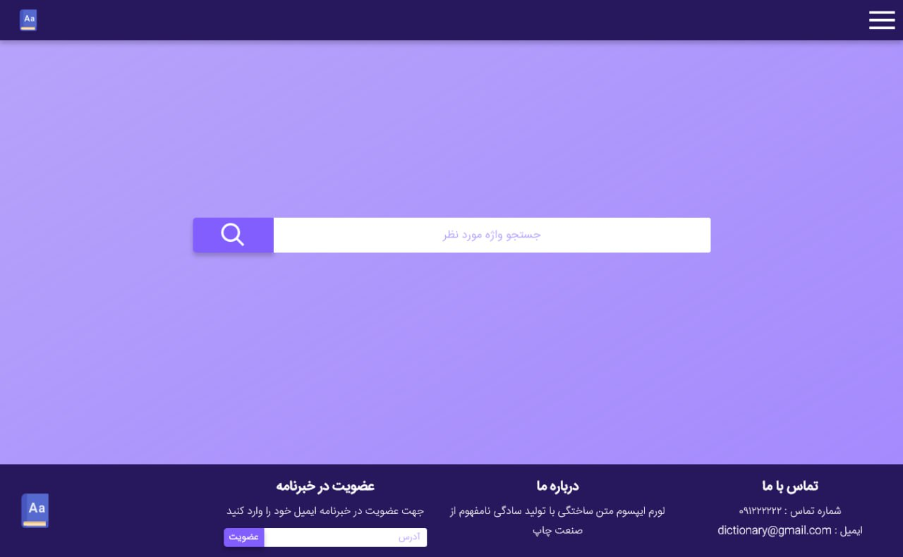
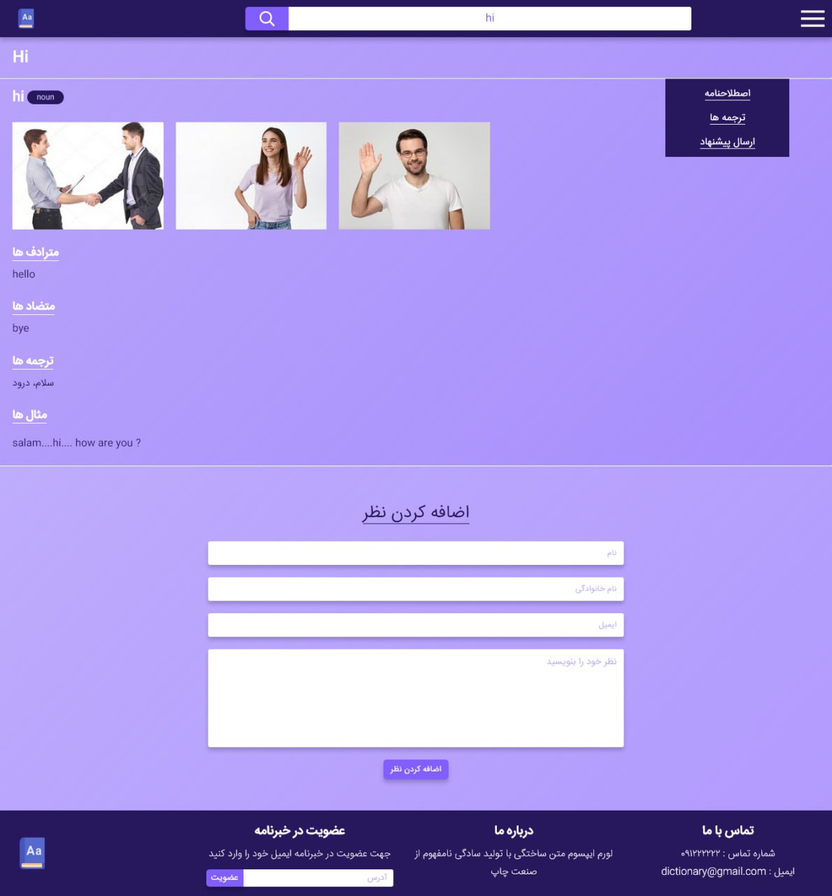
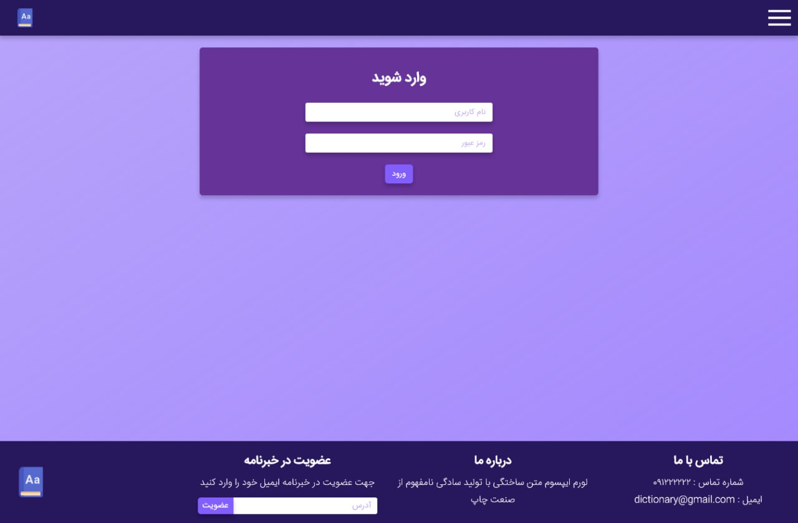
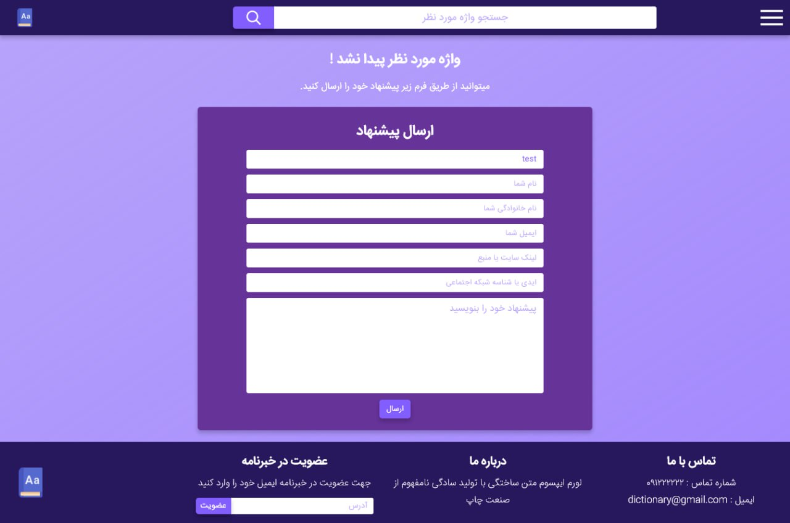

# PGU Dictionary

A bilingual dictionary web application built with Django, supporting Persian (Farsi) and English languages. Users can search for word meanings or translations with a user-friendly interface that handles right-to-left (RTL) text for Farsi.

## Features

- **Bilingual Support**: Search words in Persian (Farsi) and English
- **Right-to-Left (RTL) Support**: Proper text alignment for Farsi, ensuring a native user experience.
- **Popup Support**: Select a work in example section shows popup for better user experience.
- **Comment and Reply system**: You can add comments and replies
- **Groups and Permissions**: There are certain groups with specific permissions

## Requirements

- Python 3.7
- Django 3.2
- Dependencies listed in `requirements.txt`

## Installation

1. **Clone the Repository**:
    
    ```bash
    git clone https://github.com/vinixdev/pgu-dictionary.git
    cd pgu-dictionary
    ```
    
2. **Create a Virtual Environment**:
    
    ```bash
    python -m venv venv
    source venv/bin/activate  # On Windows: venv\Scripts\activate
    ```
    
3. **Install Dependencies**:
    
    ```bash
    pip install -r requirements.txt
    ```
    
4. **Apply Migrations**:
    
    ```bash
    python manage.py migrate
    ```
    
5. **Run the Development Server**:
    
    ```bash
    python manage.py runserver
    ```
    
    Open `http://localhost:8000` in your browser.
    

## Usage

1. Access the app at `http://localhost:8000`.
2. Search for a word to view its meaning or translation.

## Screenshots

Below are screenshots of the application’s interface.
- **Home page**:  
    
- **Result page**:
    
- **Submit proposal**:
    
- **Login page**
    


## License

This project is licensed under the MIT License. See the `LICENSE` file for details.
